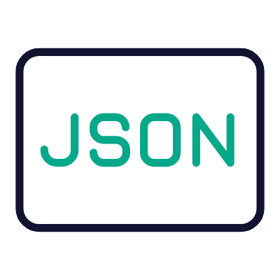

<h2>💫 About Me :</h2>
📛 My Name : Saharat Suwannapapond 📖 My Nicename : Sarus 🏫 I Study in Walailak University 

<h2> Port</h2>

 
	 

 

<h2>:memo: Languages and Tools :</h2>

<table>
	<tr>
		<td align="center" width="96">
	       HTML5
	    </td>
		<td align="center" width="96">
	       CSS
	    </td>
		<td align="center" width="96">
	       JavaScript
	    </td>
	</tr>
	<tr>
		<td align="center" width="96">
	       Python
	    </td>
		<td align="center" width="96">
	       PHP
	    </td>
		<td align="center" width="96">
	       Sql
	    </td>
	</tr>
	 <tr>
		<td align="center" width="96">
	       NoSql
		<td align="center" width="96">
	       React
	    </td>
		 <td align="center" width="96">
	       Json
	    </td>
	 </tr>

</table>

<h2>💻 Tech Stack :</h2>

	
	
	
	
	
	
	
	
	
	
	
	
	
	
	
	
	
	
	
	
	
	
	
	
	
	

<h2>🌐 Socials: Contact me :</h2>

<h2>📚 Other Skills :</h2>

	
	
	
	
	
	

<h2>🏆 GitHub Trophies :</h2>

<h2>📊 GitHub Stats :</h2>

  
  

  
  

<h2>🔝 Top Contributed Repo :</h2>

