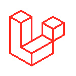

 
 
 
 
 
 
 

### 🧑‍💼 | About Me :

	
    👤 My Name : Saharat Suwannapapond
    🏷️ My Nicename : Sarus
    🎓 I Study in Walailak University
    

<h3 align="right"> 🌐 > Contact Me : &nbsp;</h3>

 

	&nbsp;

 

<picture>
  <source
    media="(prefers-color-scheme: dark)"
    srcset="svg/snake/snake-dark.svg"
  />
  <source
    media="(prefers-color-scheme: light)"
    srcset="svg/snake/snake-light.svg"
  />
  
</picture>

<picture>
 
</picture>

<h2>:memo: Languages and Tools :</h2>

<table align="center">
   <tr>
	<td align="center" width="96">
	        HTML5
	</td>
	<td align="center" width="96">
	        CSS
	</td>
	<td align="center" width="96">
	        JavaScript
	</td>
	<td align="center" width="96">
	        Python
	</td>
	<td align="center" width="96">
	        PHP
	</td>
	<td align="center" width="96">
	        Java
	</td>
	<td align="center" width="96">
	        Dart
	</td>
   </tr>

   <tr>
	<td align="center" width="96">
	        Flutter
	</td>
	<td align="center" width="96">
	        React.js
	</td>
	<td align="center" width="96">
	        Vue.js
	</td>
	<td align="center" width="96">
	        Laravel
	</td>
	<td align="center" width="96">
	        Golang
	</td>
	<td align="center" width="96">
	        Node.js
	</td>  
	<td align="center" width="96">
	        Sql
	</td>
   </tr>

   <tr>
	<td align="center" width="96">
		 NoSql
	</td>
	<td align="center" width="96">
		 Git
	</td>
	<td align="center" width="96">
	        Owl
	</td>
	<td align="center" width="96">
	        Bootstrap
	 </td>
	<td align="center" width="96">
	        Owl
	</td>
	<td align="center" width="96">
	        Bootstrap
	</td>
	<td align="center" width="96">
	        Bootstrap
	</td>
   </tr>
</table>

<h2>🏆 GitHub Trophies :</h2>

<h2>📊 GitHub Stats :</h2>

  

  
  

  
  

<h2>🔝 Top Contributed Repo :</h2>

	
  
  

