 
 
 
 
 
 
 

### 🧑‍💼 | About Me :

    👤 **My Name**: Saharat Suwannapapond  
    🏷️ **Nickname**: Sarus  
    🎓 **Studying at**: Walailak University  

<h3 align="right"> 🌐 > Contact Me : &nbsp;</h3>

 
    
    
    
    
    

### 🎵 Music Player

---

### :memo: Languages and Tools :

<table align="center">
   <tr>
      <td align="center" width="96">
          HTML5
      </td>
      <td align="center" width="96">
          CSS
      </td>
      <td align="center" width="96">
          JavaScript
      </td>
      <td align="center" width="96">
          Python
      </td>
      <td align="center" width="96">
          PHP
      </td>
      <td align="center" width="96">
          Java
      </td>
      <td align="center" width="96">
          Dart
      </td>
   </tr>
   <tr>
      <td align="center" width="96">
          Flutter
      </td>
      <td align="center" width="96">
          React.js
      </td>
      <td align="center" width="96">
          Vue.js
      </td>
      <td align="center" width="96">
          Laravel
      </td>
      <td align="center" width="96">
          Golang
      </td>
      <td align="center" width="96">
          Node.js
      </td>
      <td align="center" width="96">
          MySQL
      </td>
   </tr>
   <tr>
      <td align="center" width="96">
          NoSQL
      </td>
      <td align="center" width="96">
          Git
      </td>
      <td align="center" width="96">
          Owl
      </td>
      <td align="center" width="96">
          Bootstrap
      </td>
   </tr>
</table>

---

### 🏆 GitHub Trophies :

---

### 📊 GitHub Stats :

  

  
  

  

